<h1 align="center">
    🚆 ShortestTM Path 🚆
</h1>

<p align="center">
  <b>Full stack web app to find the shortest STM metro path between two stations</b>
</p>

<p align="center">
  👉 <b>App link:</b> <a href="https://shortesttm-path-frontend.onrender.com/" target="_blank">https://shortesttm-path-frontend.onrender.com/</a>
</p>

<div align="center">

 [](#) [](#) [](#) [](#) [](#) [](#) [](#) [](#) [](#) [](#) [](#)  [](#) [](#) [](#) [](#) [](#)  [](#) [](#) [](#)  [](#) [](#) [](#)  

</div>

<hr>

## 🛠️ Main technologies 🛠️

- **Frontend:** Angular
- **Backend:** Spring Boot in Java
- **API testing:** REST Assured
- **End-to-end testing:** Cypress

## 📚 Documentation 📚

### Javadoc

The latest valid (no warnings and errors during the generation) Javadoc is available at [https://antoinebrunet1.github.io/shortesttm-path/](https://antoinebrunet1.github.io/shortesttm-path/).

Using GitHub Actions, in `.github/workflows/deploy_javadoc.yml`, on each push on the `main` branch and on each pull request to the `main` branch, I generate the Javadoc and push the folder with the Javadoc to the `gh-pages` branch as the root folder. The Javadoc is deployed using GitHub Actions from the root folder of the `gh-pages` branch.

### Swagger

The Spring Boot backend API is documented using Swagger. The documentation can be access at the path `/swagger-ui/index.html`.

## 💻 Local setup 💻

### Backend

1. Run the Spring Boot backend API by running the `main` method in

    ```
    backend/shortesttm_path/src/main/java/com/example/shortesttm_path/ShortesttmPathApplication.java
    ```
2. Call the backend API using this URL:

    ```
    http://localhost:8080/shortest_path?startingStation=startingStation&destinationStation=destinationStation
    ```
   
    with values for the two stations. The stations names can be found in the `.txt` files under this folder:

   ```
   backend/shortesttm_path/src/main/resources/static
   ```
   
   The two stations should not be on the same line.

### Frontend

1. From the `frontend/shortesttm-path` folder, start the Angular application by running the command

    ```
   ng serve
   ```

2. To see the application, go to

    ```
   http://localhost:4200/
   ```
   
### End-to-end testing

There is a folder called `e2e_testing` at the root of this project. For the local setup, I suggest having a look to this YouTube tutorial: https://youtu.be/u8vMu7viCm8?si=WsX5De56Bry3kdfh.

##  💡 Backend algorithm overview 💡

I get the shortest path as a list of stations using an algorithm called for weighted directed graphs I found at https://medium.com/@robinviktorsson/dijkstras-algorithm-in-java-learn-with-practical-examples-9e7af310e466.

This algorithm is using integers. I just map the stations names to integers to find the path and after that I map the integers back to stations names.

For the HTTP response, I only want to send, for the path, the starting station, the destination station and stations used to switch lines between the first and last stations.

To get the stations used to switch lines between the first and last stations, I take the stations that have at least two lines and that are used to actually switches lines. That can be detected by making sure that the previous and next stations are not on the same line.

## 🔄 The Maven plugins through the Maven lifecycle 🔄

<div align="center">
    
</div>

## 🧪 API testing 🧪

The test cases are in

```
api_testing/shortesttm_path_api_testing/src/test/resources/test_cases/api_testing_test_cases.json
```

There is a JSON schema called `custom_api_testing_test_cases_schema.json` for that file in the same folder.

For each test case, the name remains exactly the same in:

1. The test cases JSON file
2. The names of the JSON files in:
    
    ```
   api_testing/shortesttm_path_api_testing/src/test/resources/expected_bodies
    ```
   
3. The names of the test methods in:

    ```
   api_testing/shortesttm_path_api_testing/src/test/java/controllers/Tests.java
    ```

## ✨ Code quality guarantied ✨

The main branch of this repository contains a GitHub Actions CI/CD pipeline to indicate if the code meets the below quality checks or not.

1. The Javadoc documentation is valid.
2. The style of the non-test Java classes follows `backend/shortesttm_path/google_checks.xml`.
3. Cyclomatic complexity is not over 7 for the backend.
4. The unit tests coverage is at least 80% for the backend. It is by class and by line.
5. The unit tests coverage is at least 80% for the frontend. It is by line.
6. The API tests pass.
7. The end-to-end tests pass.

## ✅ Check code quality locally ✅

### Backend

To check Javadoc, style, complexity and unit tests coverage, run the command

```
mvn clean verify -DskipTests
```

#### 📚 Javadoc 📚

To check if the documentation is valid and generate it if it is, run the command

```
mvn clean javadoc:javadoc -Dcheckstyle.skip=true
```

or

```
make javadoc
```

If you want to run the command for only a particular class, run the command

```
mvn clean javadoc:javadoc -Dcheckstyle.skip=true -DclassName=
```

and add the name of the class at the end with no spaces before.

The Javadoc is generated in

```
backend/shortesttm_path/target/reports/apidocs
```

You can view it by opening `index.html`.

#### 📐 Style and cyclomatic complexity 📐

To check style and cyclomatic complexity, run the command

```
clean package -DskipTests -Dmaven.javadoc.skip=true
```

or

```
make checkstyle-backend
```

#### 🧪 Unit tests 🧪

In IntelliJ, the unit tests can be run as a whole or individually by clicking a green triangle.

#### 🎯 Unit tests coverage 🎯

To check if the coverage is at least 80% (calculated by class and by line), run the command

```
mvn clean verify -Dmaven.javadoc.skip=true -Dcheckstyle.skip=true
```

or

```
make cov-backend
```

### Frontend

#### 🎯 Unit tests coverage 🎯

To check if the coverage is at least 80% (calculated by line), run the command (in a UNIX terminal like on macOS, Linux or in Git Bash (which also works on Windows))

```
cd frontend/shortesttm-path && npx ng test --watch=false --browsers=ChromeHeadless --code-coverage \
	| grep "Lines        :" | cut -d ':' -f 2 | cut -d '%' -f 1 | cut -d ' ' -f 2 | awk '{ if ($1 < 80) exit 1 }'
```

or

```
make cov-frontend
```

### 🧪 API testing 🧪

You can run the API tests using this command from the `api_testing/shortesttm_path_api_testing` folder:

```
mvn clean test
```

or

```
make api-tests
```

If you are using IntelliJ, you can run the API tests by clicking the green triangle next to the class name in

```
api_testing/shortesttm_path_api_testing/src/test/java/controllers/Tests.java
```

You can also run single tests by clicking the green triangle next to them.

### 🧪 End-to-end testing 🧪

You can run the end-to-end tests using this command from the `e2e_testing` folder:

```
npx cypress run --browser chrome
```

or

```
make run-e2e-tests
```

## 🛡️ Security 🛡️

### Safety guarantied for all the dependencies

This project uses Dependabot to automatically open PRs for security issues and also for general library version updates.

### `main` branch protection

The `main` branch is protected by a ruleset called "No deletions and force push for main".

## 🌐 Hosting 🌐

The frontend and the backend API are hosted using Render. UptimeRobot is used to keep the backend API alive.